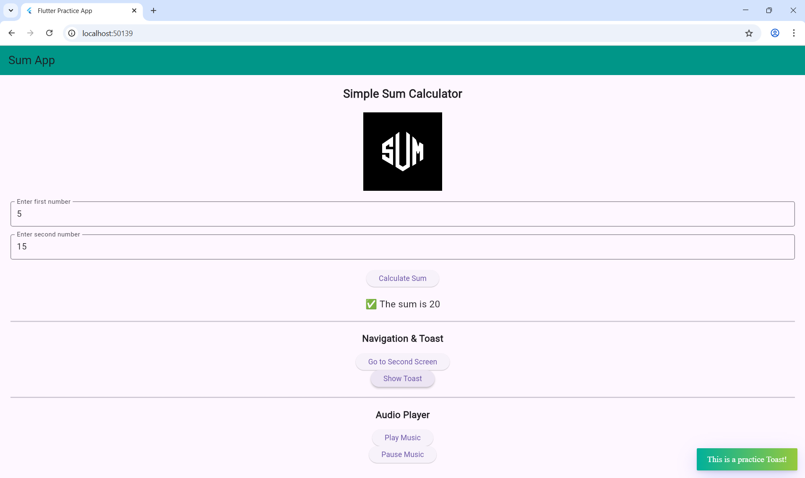
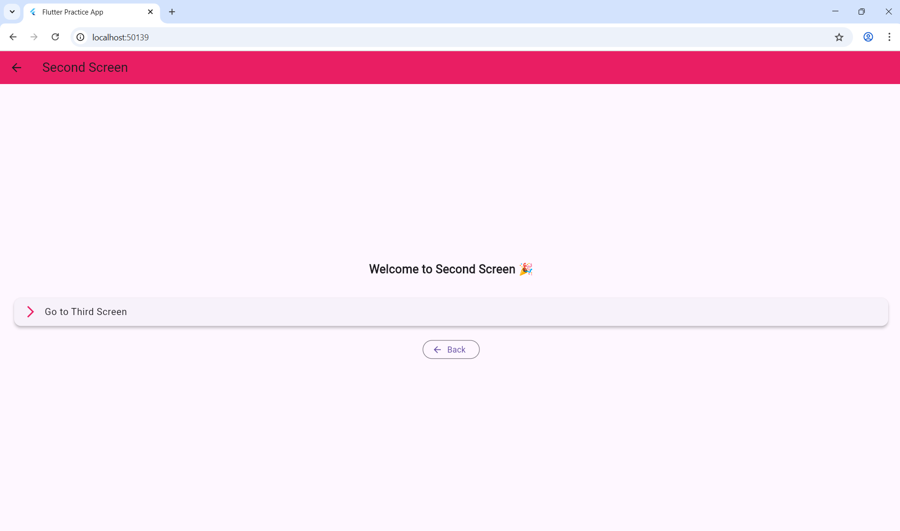
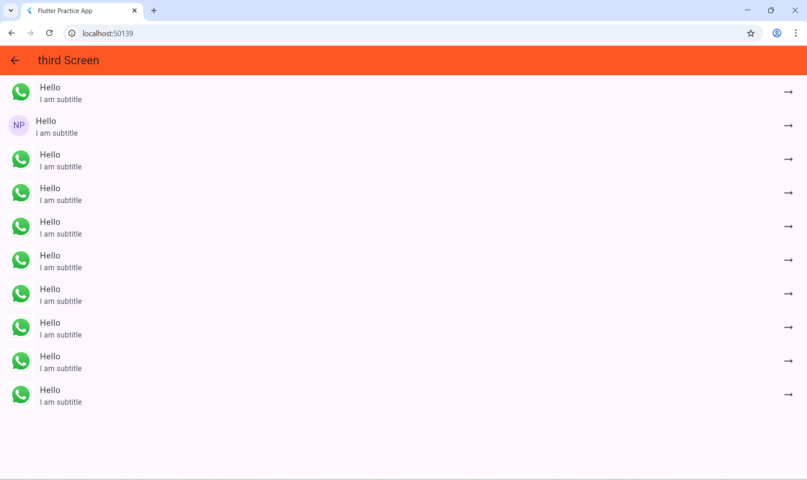

# 📱 Flutter Sum App

A simple Flutter application that demonstrates the following concepts:

- ✅ Taking user input and calculating the sum of two numbers  
- ✅ Navigation between multiple screens (`SecondScreen`, `ThirdScreen`)  
- ✅ Toast messages for user interaction feedback  
- ✅ Audio player integration for playing local music  
- ✅ Clean and structured Flutter project setup  

---

## 🚀 Features

- **Sum Calculator** – Enter two numbers and instantly get their sum.  
- **Multi-Screen Navigation** – Practice with multiple screens and navigation.  
- **Toast Messages** – Quick pop-up messages for better UX.  
- **Audio Player** – Play an audio file stored in assets.  

---

## 📸 Screenshots

| First Screen | Second Screen | Third Screen |
|-------------|---------------|---------------|
|  |  |  |
